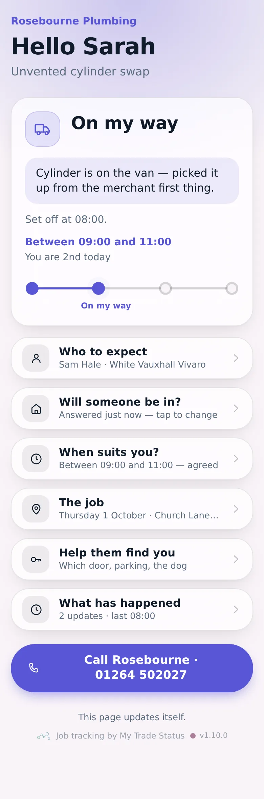
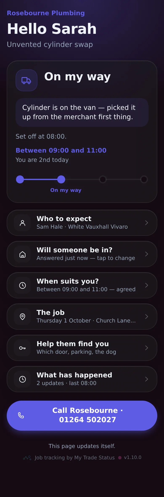
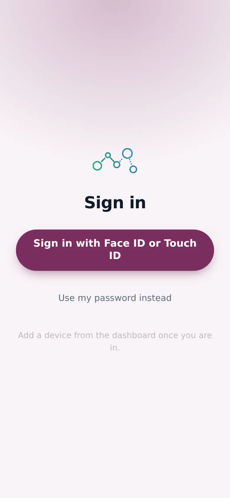
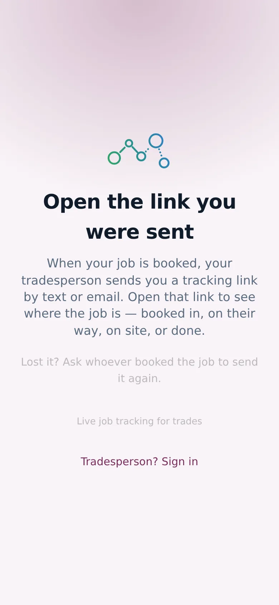

# v1.10.0 — Plum

**2026-09-30** · background `#f9f4f8` · accent `#7a2f5e`

- The page is a quarter shorter — less to scroll past before the thing that matters
- Tap any heading to open it; closed, each row says the one thing worth knowing
- Removed the notifications row until the keys are in, rather than open onto nothing
- The version line, the wordmark and the small print are now one line, not three

Not captured this time: the wallet views and the dashboard (they need an operator session).

### customer-light

### customer-dark

### login

### landing

