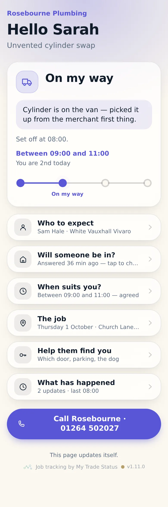
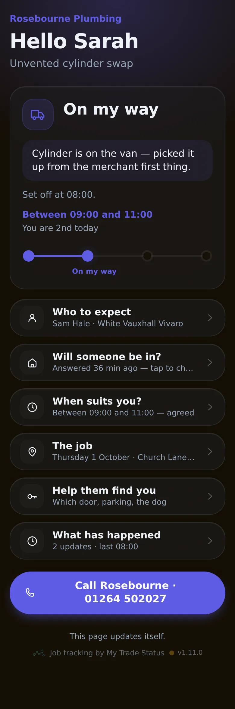
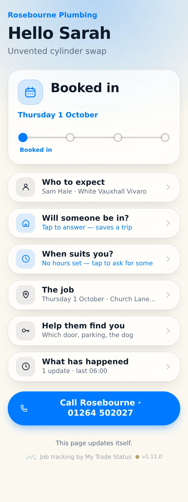
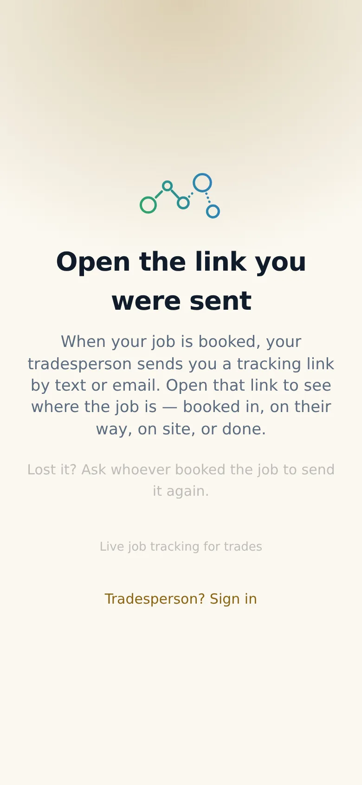

# v1.11.0 — Ochre

**2026-10-01** · background `#fbf8f0` · accent `#8a6414`

- A job that is only booked now says the day on the card, not two taps down
- Agreed hours replace it once there are any — never both, the day is implied
- One command turns push notifications on: bash scripts/enable-push.sh

Not captured this time: the wallet views and the dashboard (they need an operator session).

### customer-light

### customer-dark

### customer-booked

### login

### landing

