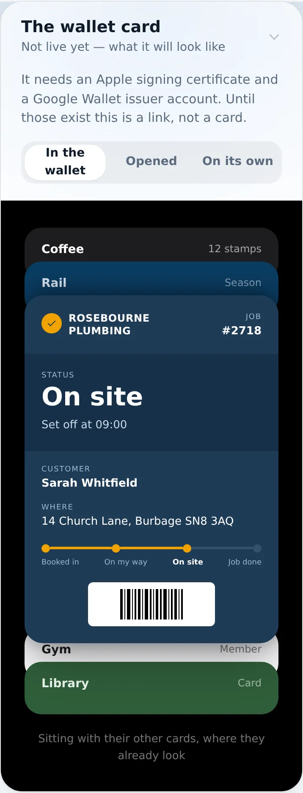
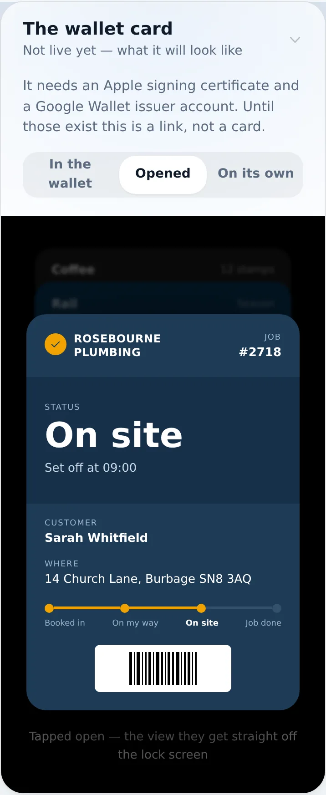
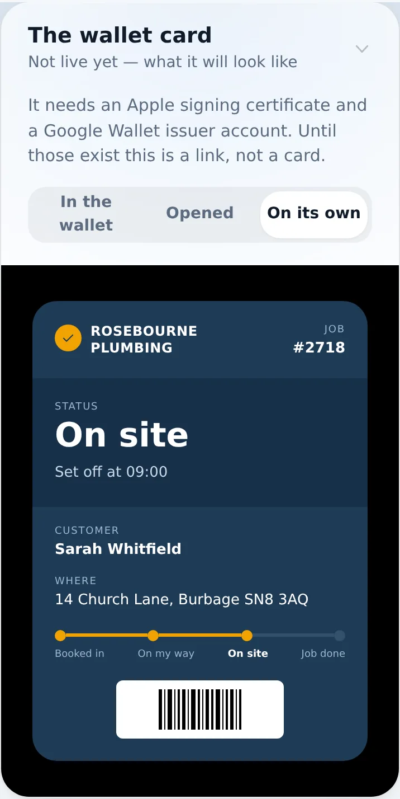
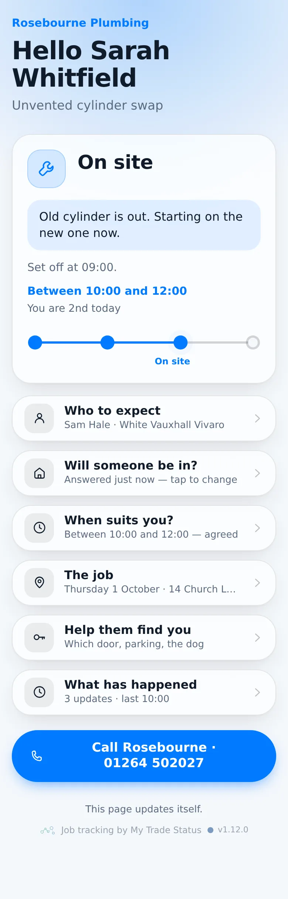
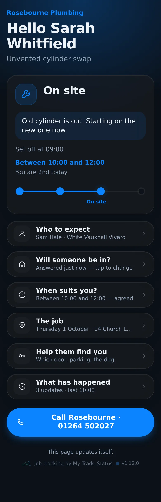
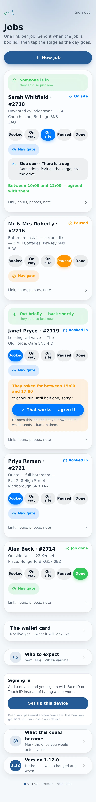
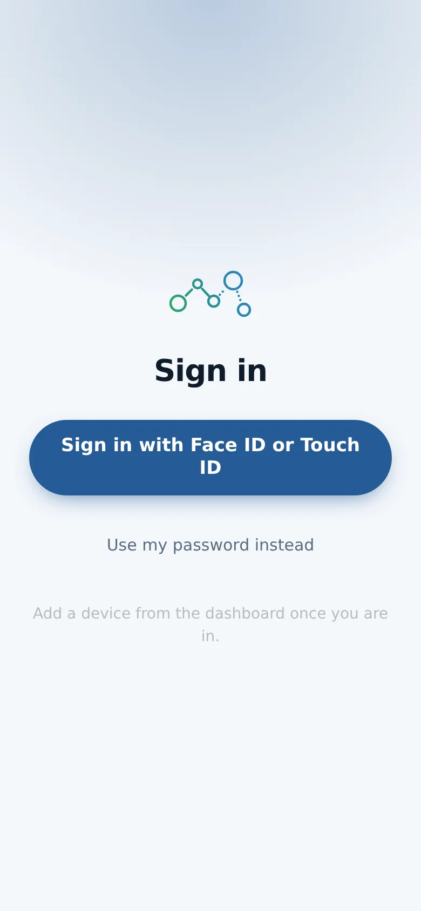
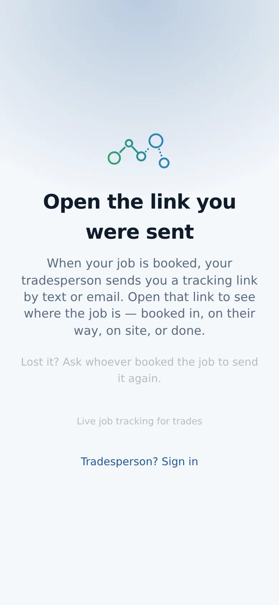

# v1.12.0 — Harbour

**2026-10-01** · background `#f4f7fb` · accent `#255a95`

- The jobs list is a day’s run now — what you are on, then what is next, finished at the bottom
- A job shows who, where and the stage buttons; tap the row for the link, hours, photos and note
- New job is a button, not six empty boxes above the work
- Dashboard went from nine screens to under four

### wallet-in-stack

### wallet-opened

### wallet-alone

### customer-light

### customer-dark

### dashboard

### login

### landing

