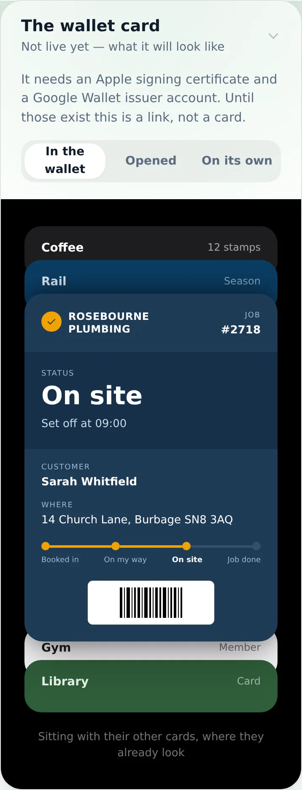
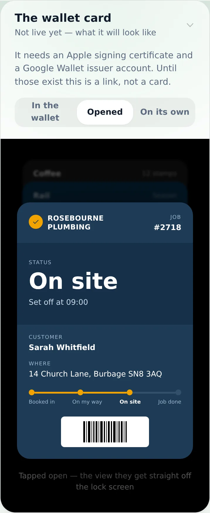
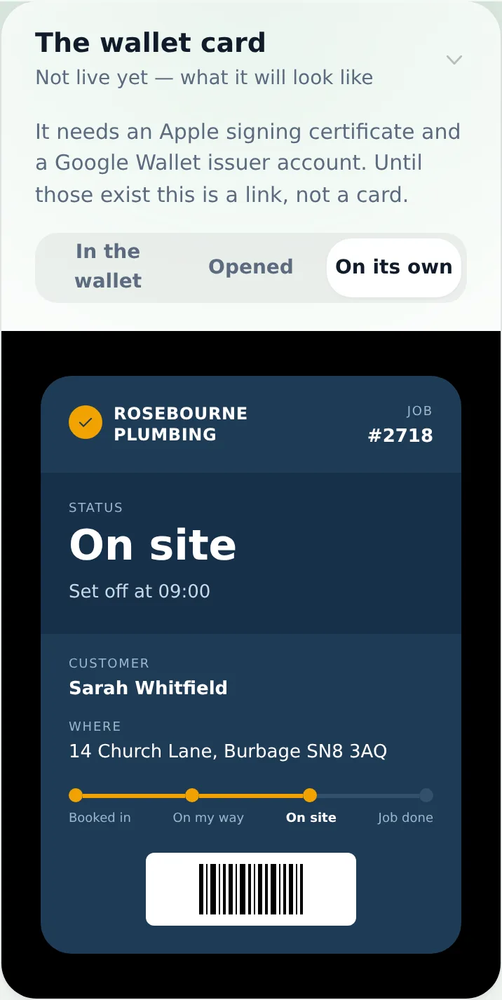
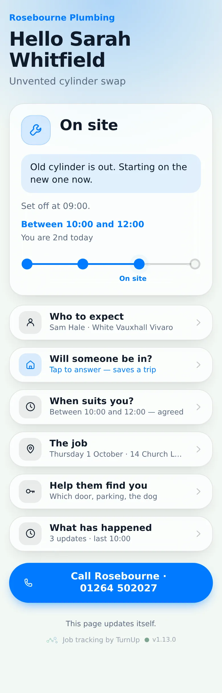
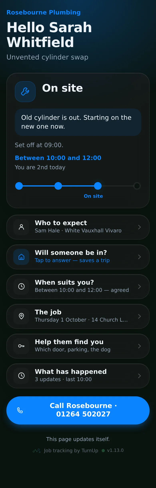
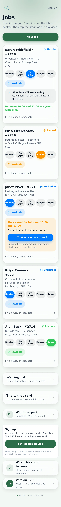
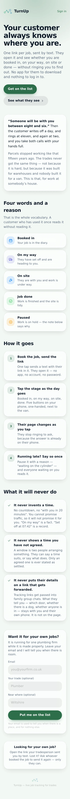
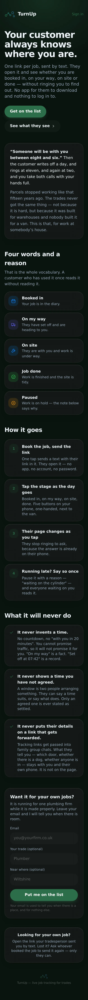

# v1.13.0 — Moss

**2026-10-01** · background `#f3f8f4` · accent `#2c6e49`

- It is called TurnUp now — renamed everywhere a person reads it
- A real homepage: what it is, what it will never do, and a working example to tap
- Trades can ask to be told when there is room; the list is on your dashboard
- The homepage is the only page search engines may see — every tracking link stays hidden

### wallet-in-stack

### wallet-opened

### wallet-alone

### customer-light

### customer-dark

### dashboard

### login

### homepage

### homepage-dark

