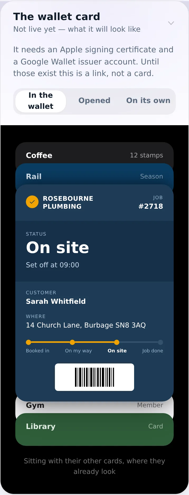
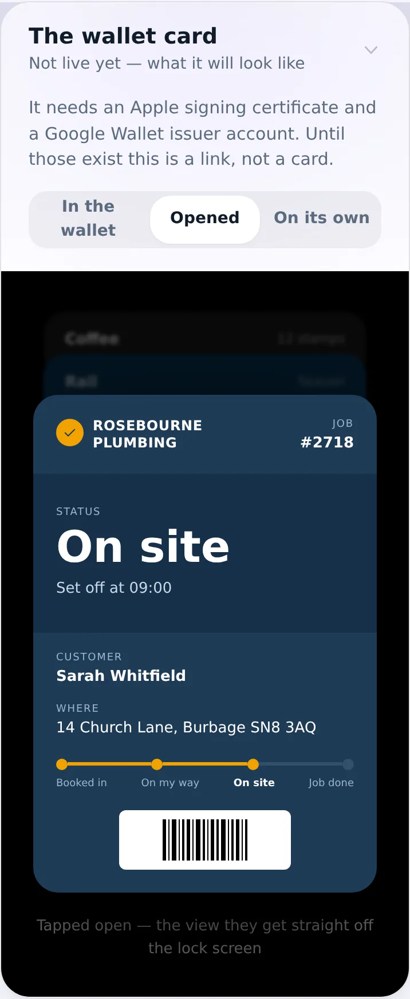
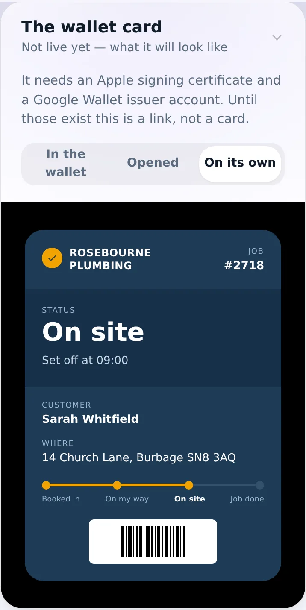
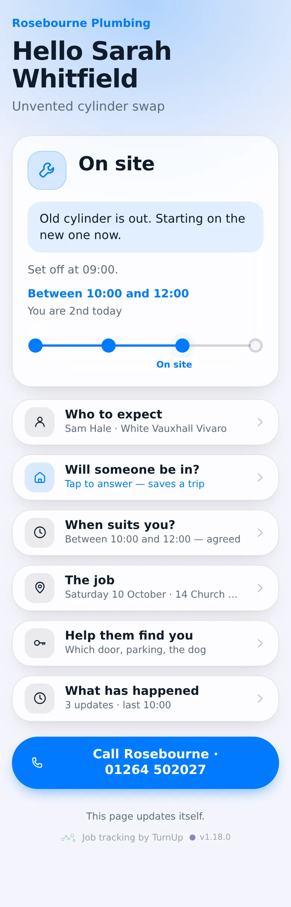
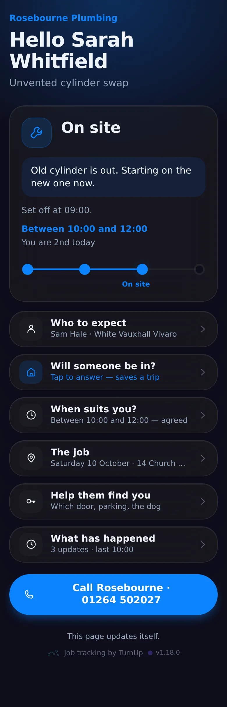
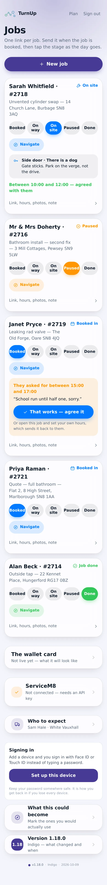
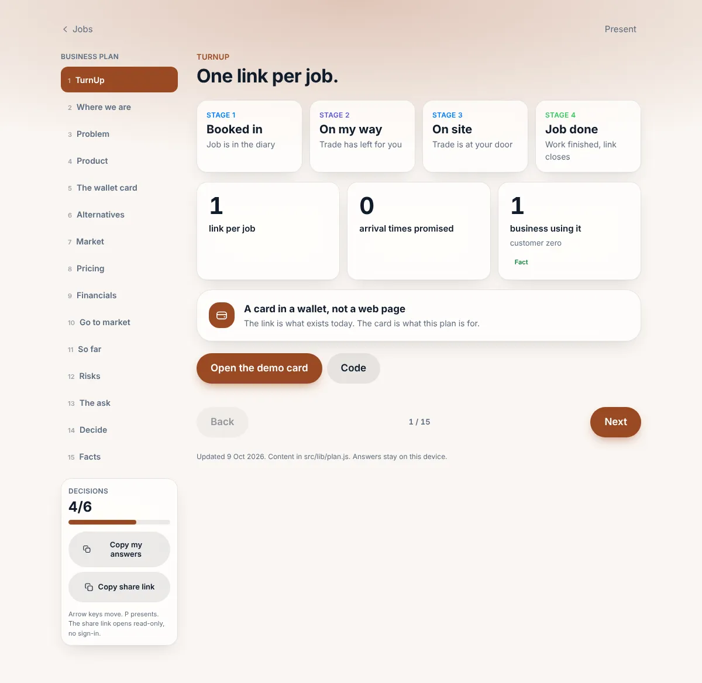
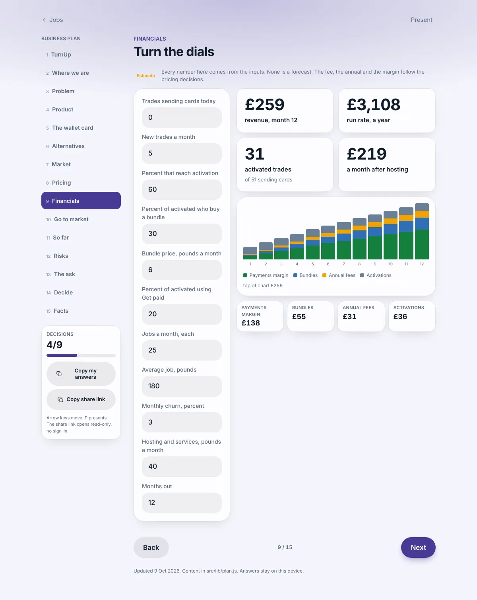
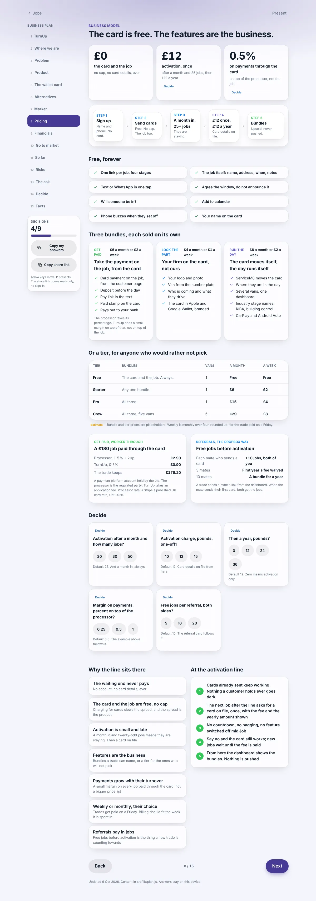
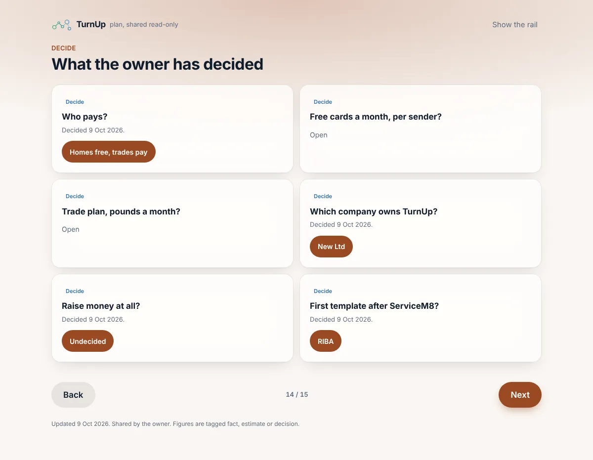

# v1.18.0 — Clay

**2026-10-09** · background `#faf6f2` · accent `#9a4a24`

- The plan at `/plan` grew to fifteen sections: a wallet-card page, a timeline read from the changelog, an ask written for one person who builds apps
- Pricing has a shape: Home free forever up to a cap, Trade and Crew pay for the trade features, Partners quoted. The cap and the Trade price are open decisions; nothing is charged yet
- A share link, `/plan/<code>`, opens the plan read-only with no sign-in
- The financials chart drew no bars; fixed

### wallet-in-stack

### wallet-opened

### wallet-alone

### customer-light

### customer-dark

### dashboard

### login

### homepage

### homepage-dark

### plan-cover

### plan-financials

### plan-pricing

### plan-shared

---

*Shots other than the plan pages were captured on 10 October, after the fact, from this version’s own commit (`6a51aab`) — checked out, built and run, so what is above is v1.18.0 and not a later build wearing its number.*

*They were missing because the capture run died on the first page too tall for WebP (the limit is 16,383px, and at 2x that is any page over about 8,190). The note that used to sit here blamed a missing tracking code; that was the wrong diagnosis. The script now scales a giant page down and carries on past a shot it cannot take.*
