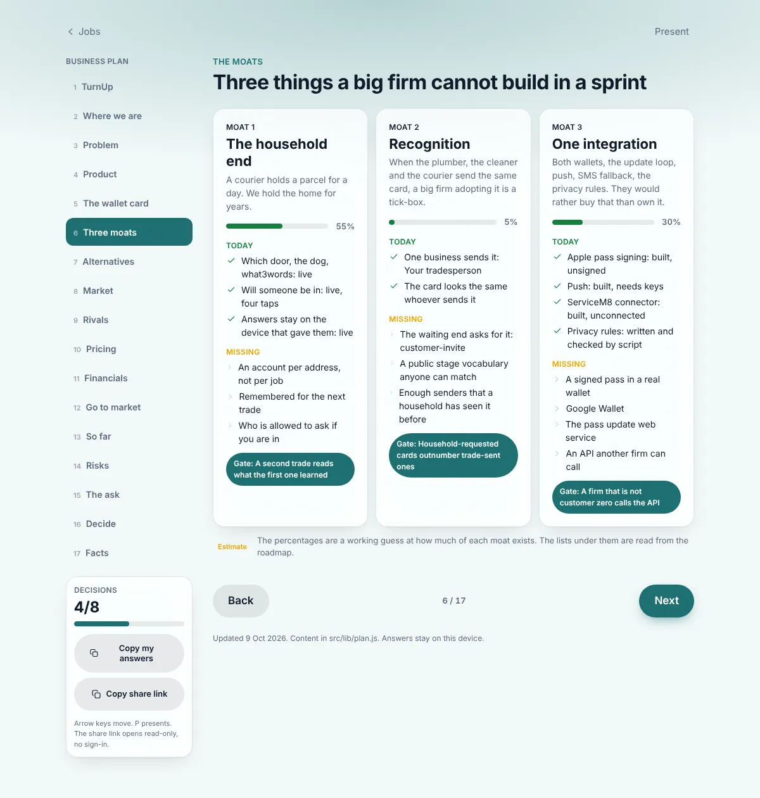

# v1.19.0 — Teal

**2026-10-09** · background `#f2f9f9` · accent `#1f6f72`

- The plan has a spine: three moats, six moves with gates, five rivals and the move that beats each, seven regulated wedges
- Pricing, third shape of the day: free for every sender, enterprise pays per card. The regulator is why they pay
- Seventeen sections. The ask for the friend is one line

### plan-moats

### plan-pricing

### plan-rivals

The customer, wallet and dashboard shots are not in this folder: this build was made away from a server with a tracking code, and the next capture fills them in.
