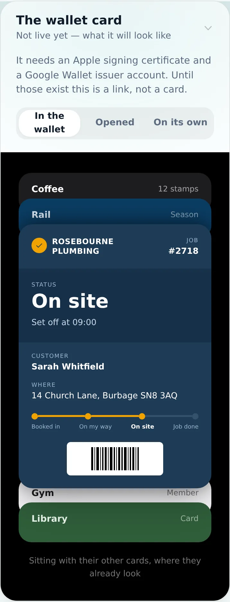
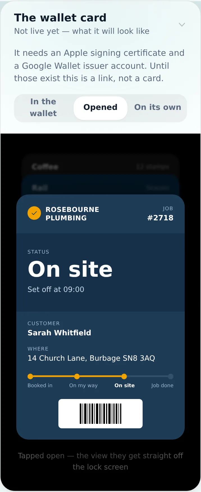
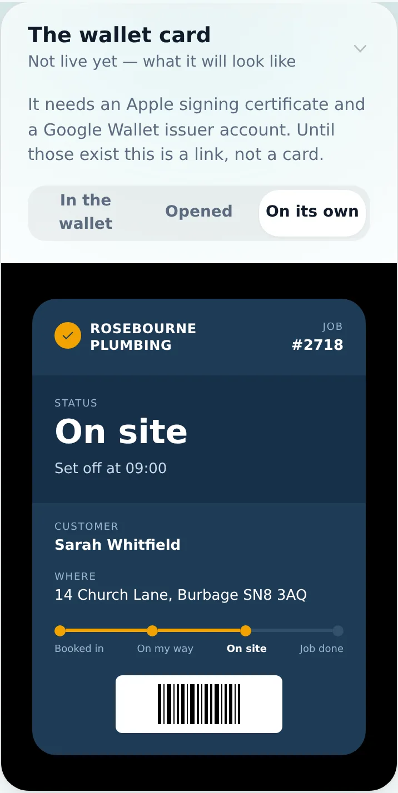
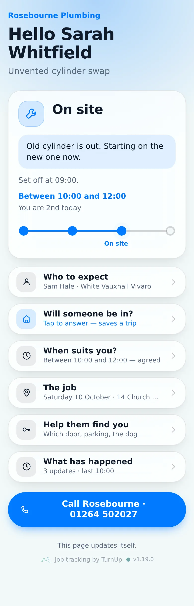
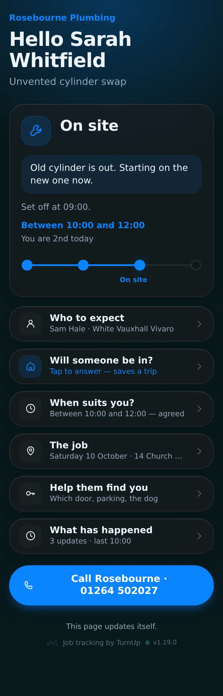
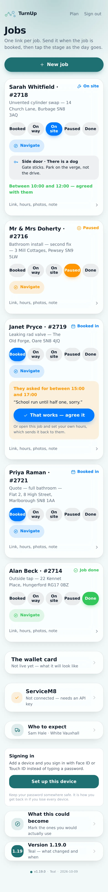

# v1.19.0 — Indigo

**2026-10-09** · background `#f5f5fc` · accent `#463a94`

- Pricing turned round: the card and the job are free, no cap. Activation charge and a small yearly fee once a trade is a month in and past a jobs threshold, card details on file
- Three bundles on top: Get paid, Look the part, Run the day. Or a tier. Monthly or weekly
- Get paid carries a small margin on top of the processor. Referrals earn free jobs before activation
- Five pricing decisions open on the plan; the calculator stacks activations, annual fees, bundles and payments margin

### wallet-in-stack

### wallet-opened

### wallet-alone

### customer-light

### customer-dark

### dashboard

### login

### homepage

### homepage-dark

### plan-financials

### plan-pricing

---

*Shots other than the plan pages were captured on 10 October, after the fact, from this version’s own commit (`d8d9105`) — checked out, built and run, so what is above is v1.19.0 and not a later build wearing its number.*

*They were missing because the capture run died on the first page too tall for WebP (the limit is 16,383px, and at 2x that is any page over about 8,190). The note that used to sit here blamed a missing tracking code; that was the wrong diagnosis. The script now scales a giant page down and carries on past a shot it cannot take.*
