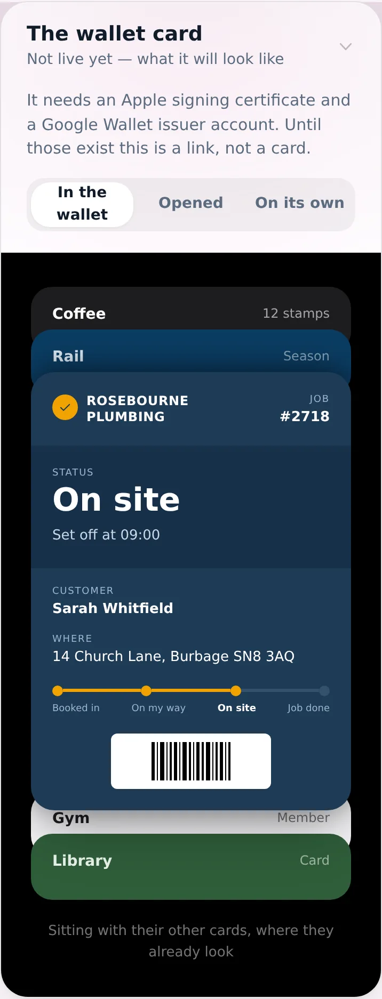
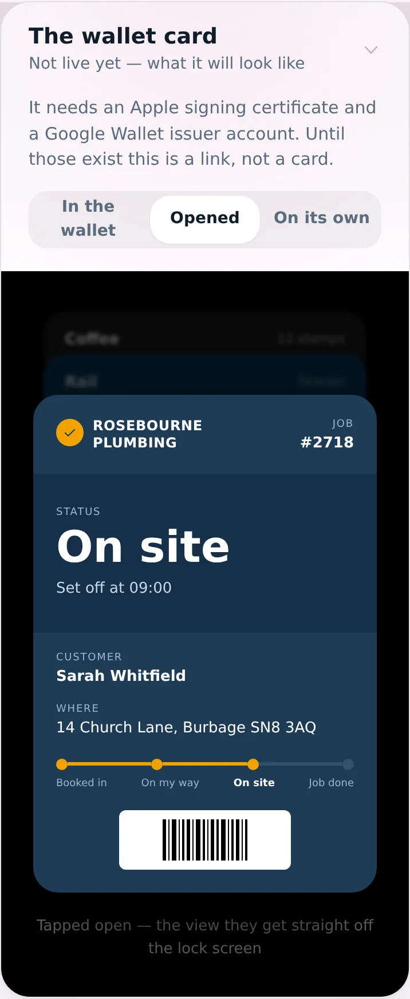
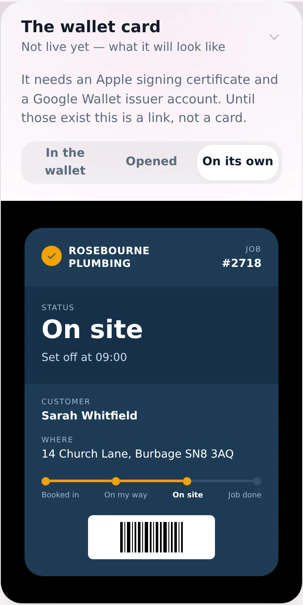
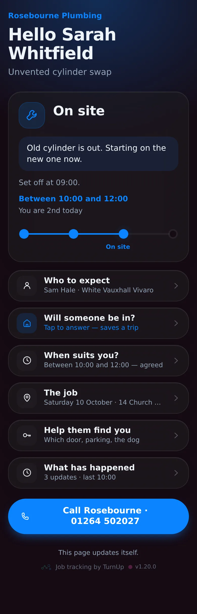
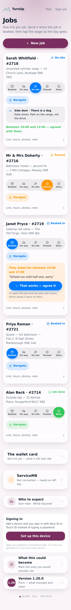

# v1.20.0 — Plum

**2026-10-09** · background `#f9f4f8` · accent `#7a2f5e`

- The plan has a spine: three moats, six moves with gates, five rivals and the move that beats each, seven regulated wedges
- Pricing, third shape of the day: free for every sender, enterprise pays per card. The regulator is why they pay
- Seventeen sections. The ask for the friend is one line

### wallet-in-stack

### wallet-opened

### wallet-alone

### customer-light

### customer-dark

### dashboard

### login

### homepage

### homepage-dark

### plan-moats

### plan-pricing

### plan-rivals

---

*Shots other than the plan pages were captured on 10 October, after the fact, from this version’s own commit (`698bc93`) — checked out, built and run, so what is above is v1.20.0 and not a later build wearing its number.*

*They were missing because the capture run died on the first page too tall for WebP (the limit is 16,383px, and at 2x that is any page over about 8,190). The note that used to sit here blamed a missing tracking code; that was the wrong diagnosis. The script now scales a giant page down and carries on past a shot it cannot take.*
