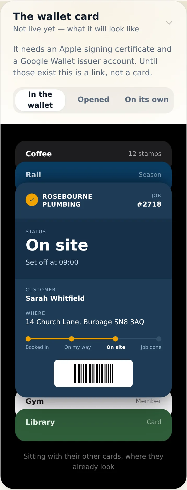
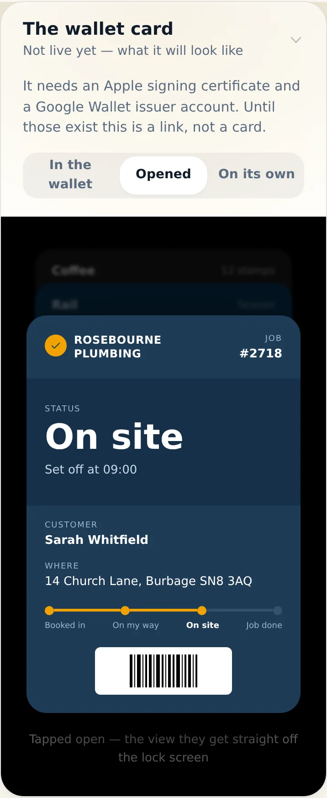
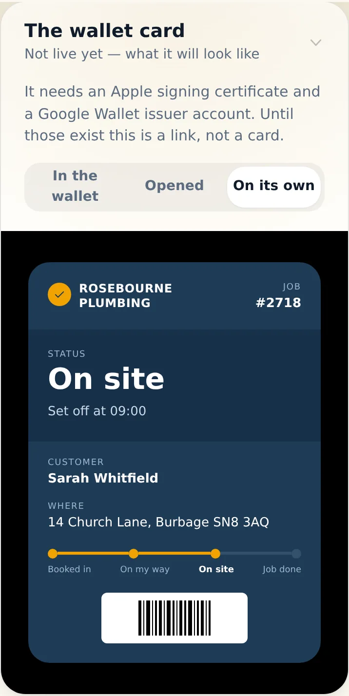
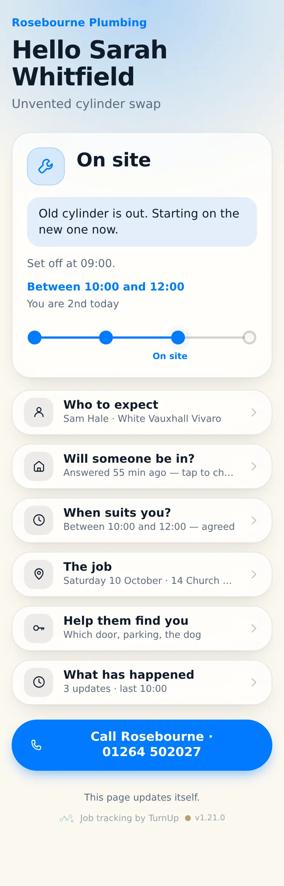
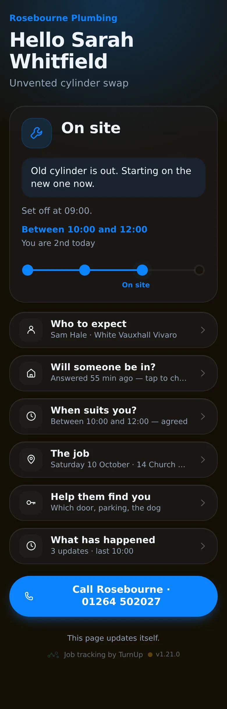
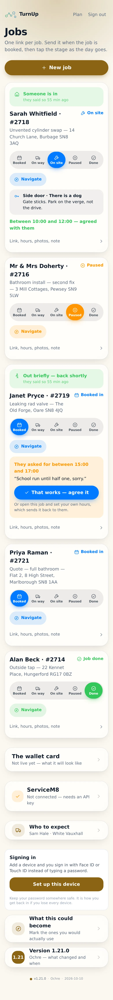
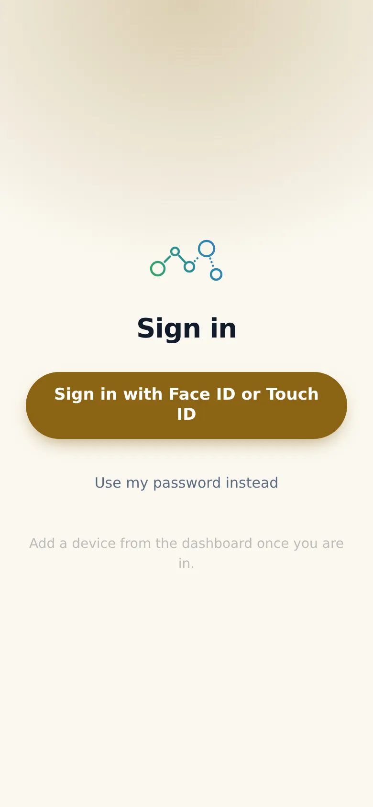



# v1.21.0 — Ochre

**2026-10-10** · background `#fbf8f0` · accent `#8a6414`

- The what3words box no longer assumes you already know your three words
- A link straight to their map, which finds you — then copy them back
- You can set three words from the van too; the dashboard field was read-only
- One tap fills it in automatically the day there is a what3words key

### wallet-in-stack

### wallet-opened

### wallet-alone

### customer-light

### customer-dark

### dashboard

### login

### homepage

### homepage-dark

