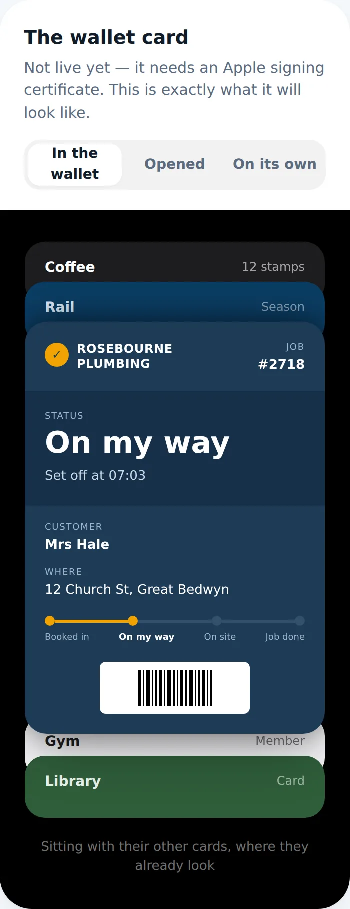
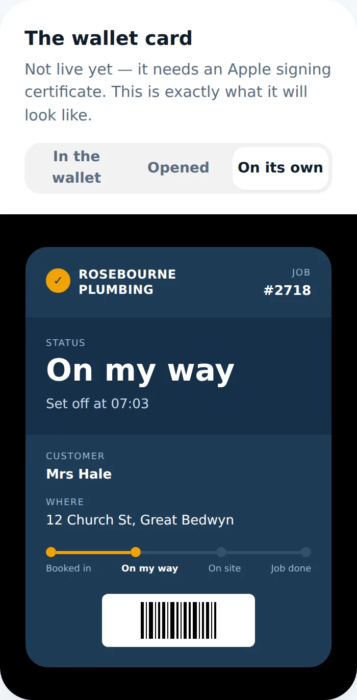
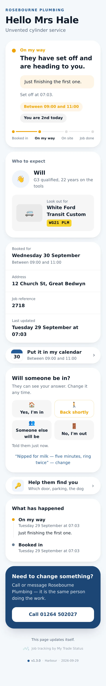
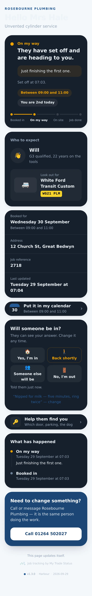
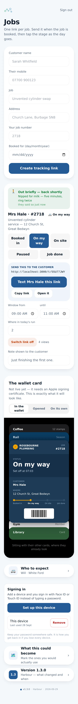

# v1.3.0 — Harbour

**2026-09-29** · background `#f4f7fb` · accent `#255a95`

- Wallet card shown three ways: in the stack, opened, on its own
- The whole roadmap in the app, with a way to vote on what gets built
- Dashboard restyled — no hard-coded greys, dark mode throughout
- Version number and theme on every page

### wallet-in-stack

### wallet-opened

### wallet-alone

### customer-light

### customer-dark

### dashboard

### login

### landing

