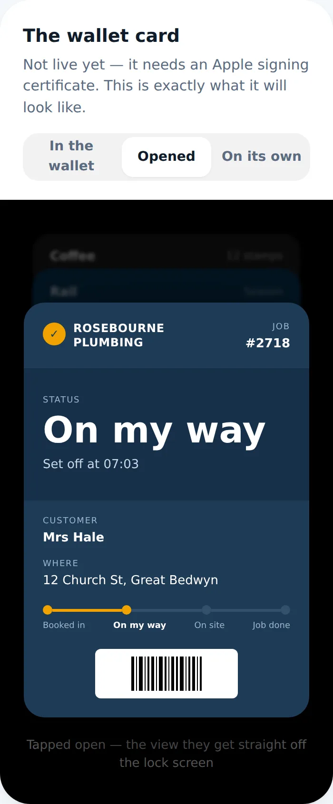
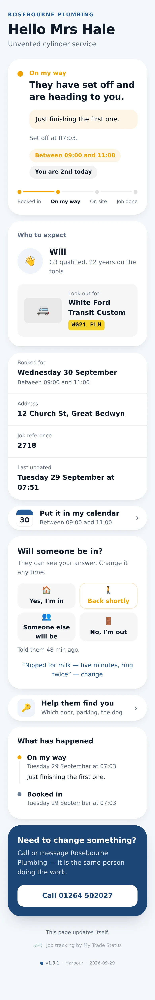
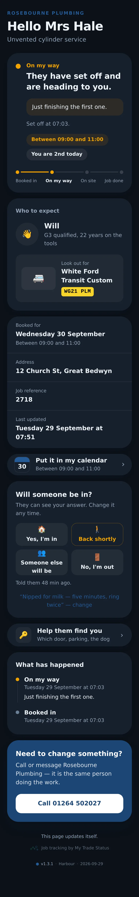
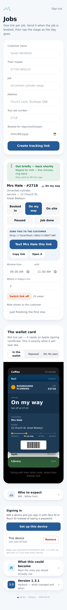

# v1.3.1 — Harbour

**2026-09-29** · background `#f4f7fb` · accent `#255a95`

- Dark mode: the page background was pinned to the light colour, so the heading was invisible. Each theme now has a dark background of its own.

### wallet-in-stack

### wallet-opened

### wallet-alone

### customer-light

### customer-dark

### dashboard

### login

### landing

