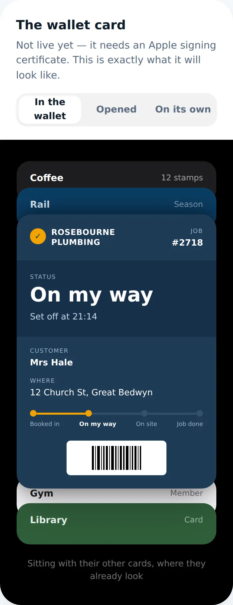
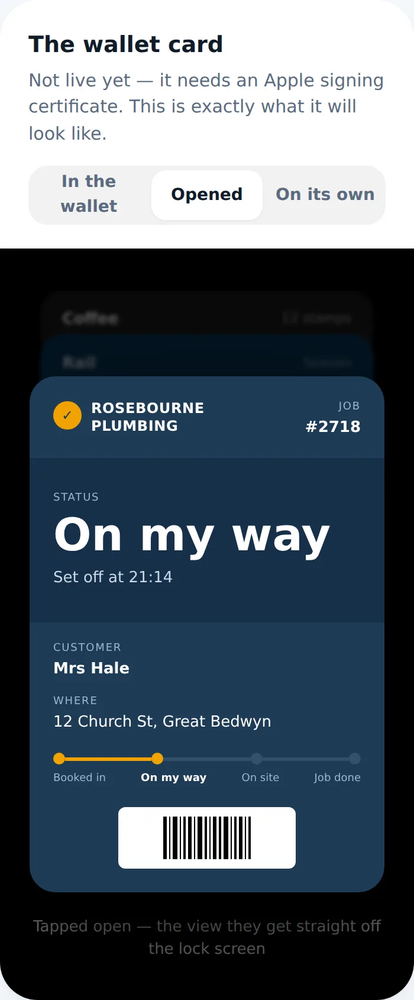
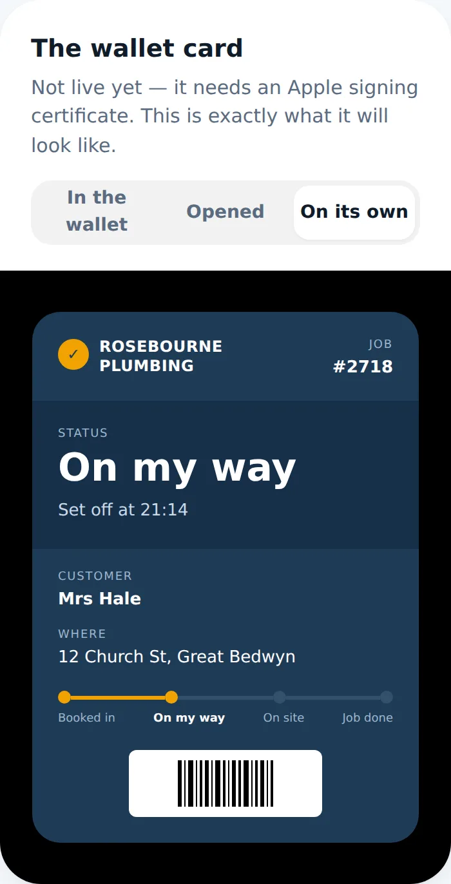
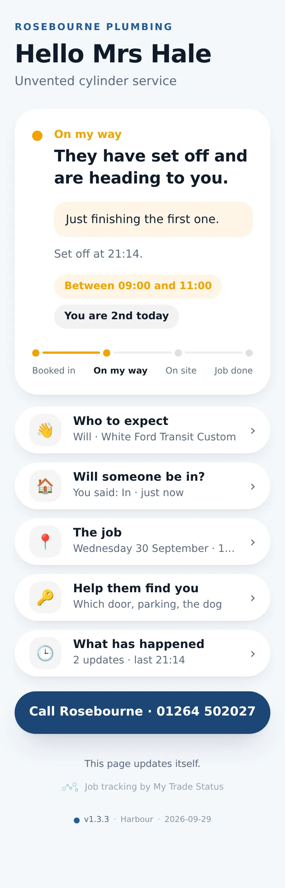
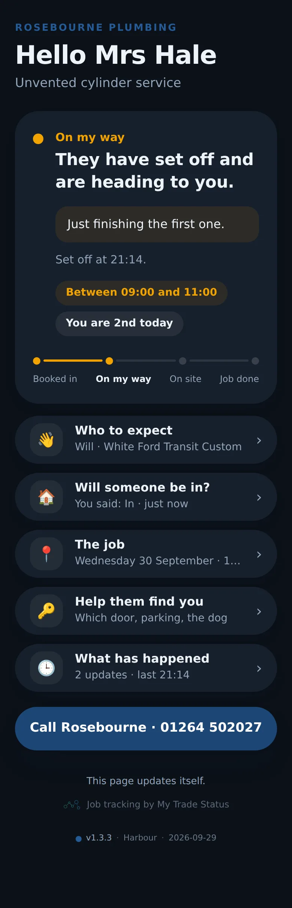
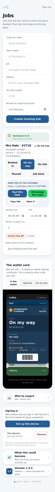
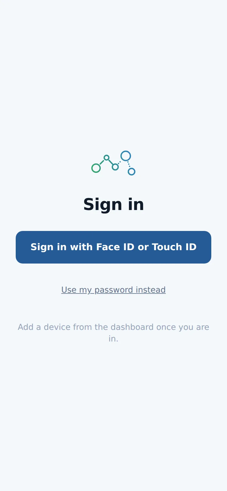
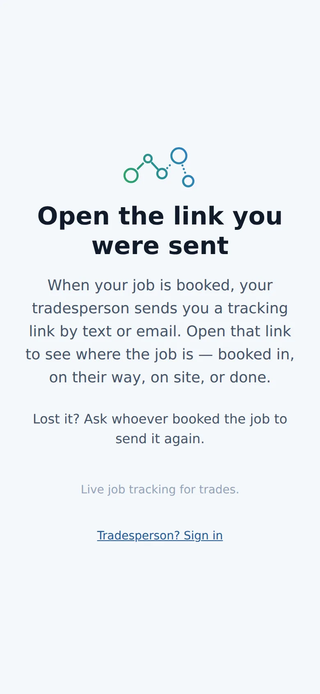

# v1.3.3 — Harbour

**2026-09-29** · background `#f4f7fb` · accent `#255a95`

- Customer page pruned: status up top, then rows that open on tap. The call button never hides.

### wallet-in-stack

### wallet-opened

### wallet-alone

### customer-light

### customer-dark

### dashboard

### login

### landing

