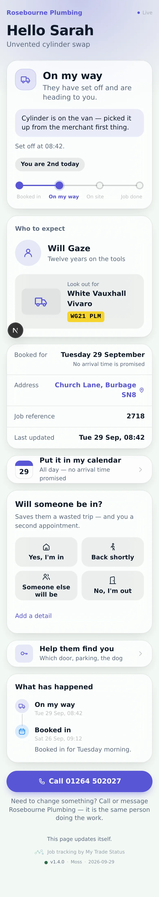
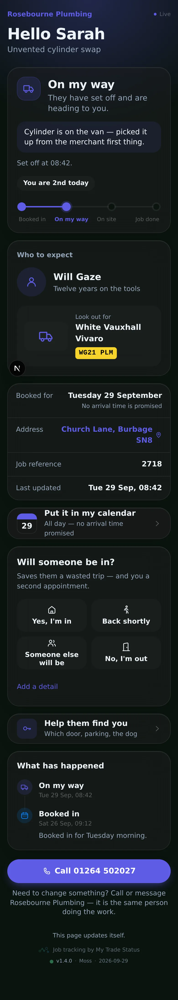
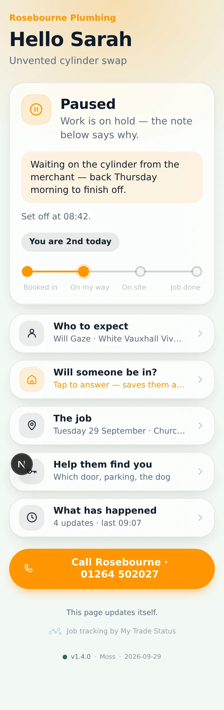
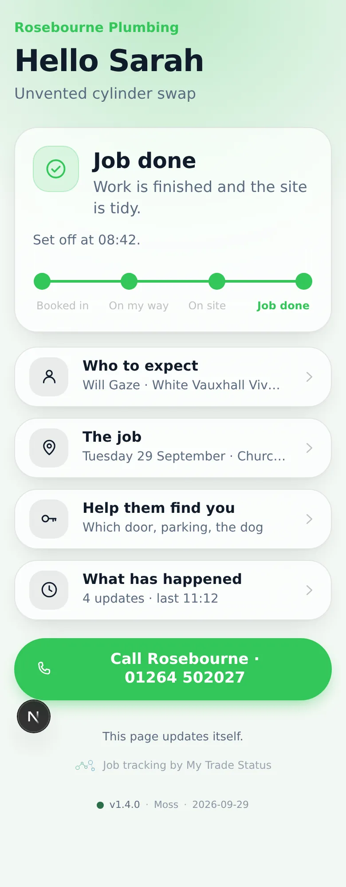
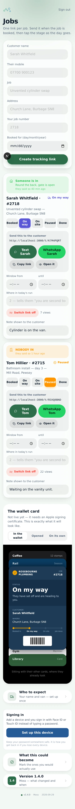
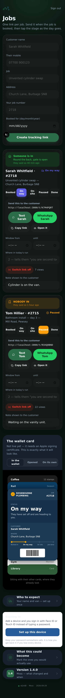
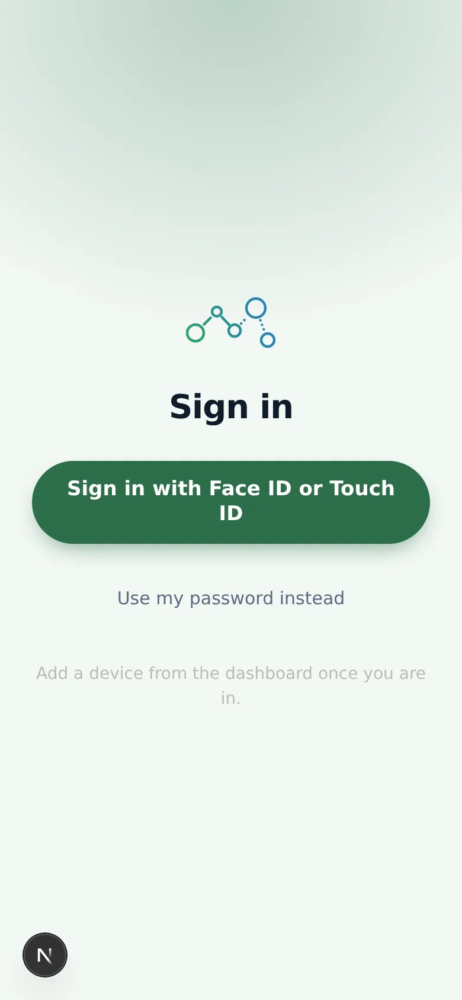
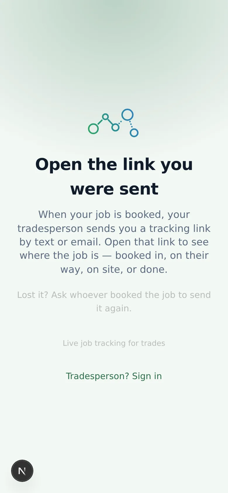

# v1.4.0 — Moss

**2026-09-29** · background `#f3f8f4` · accent `#2c6e49`

The whole app redrawn to the current iOS look: translucent layered cards over a
stage-tinted wash, the system font, inset grouped lists, proper dark mode.

Every emoji is gone. They rendered in whatever style the customer's phone
happened to ship, at a weight and colour nobody chose, and a cartoon van beside
"On my way" undid the rest of the page. Eleven drawn icons in one stroke weight
replace them, and they inherit the stage colour.

Each stage now owns a colour and keeps it — blue booked in, indigo on the way,
amber paused, green done. The theme still rotates every night, but it owns the
chrome only. A colour that means something cannot change nightly.

Also fixed: the server and the phone were formatting dates differently, which
tore the page apart as it loaded.

## About these screenshots

**Captured against sample data, not a real job.** The session that built this
release had no database, so the customer screens show a made-up job for a
made-up customer, rendered through the real components. Everything you can see
is genuinely what the code draws; only the words in it are invented.

To recapture against production with a real tracking code:
`BASE=https://tradestatus.vercel.app DEMO_CODE=<code> node scripts/capture-diary.mjs`

Note that script currently asks Playwright for `type: 'webp'`, which Playwright
1.56 rejects — these were taken as PNG and converted. Worth checking before the
next nightly run.

### customer-light

### customer-dark

### customer-paused

### customer-done

### dashboard

### dashboard-dark

### login

### landing

