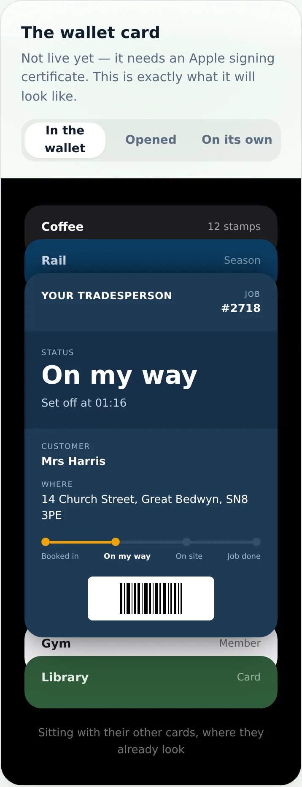
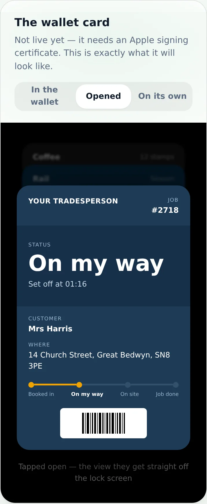
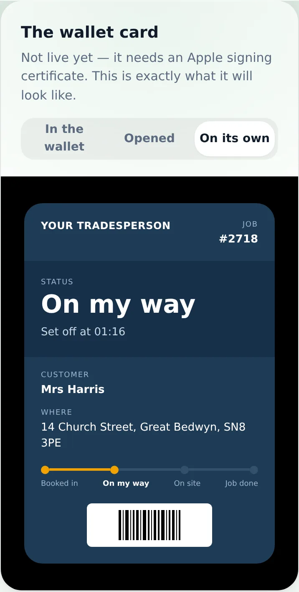
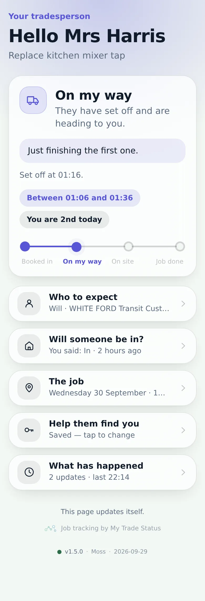
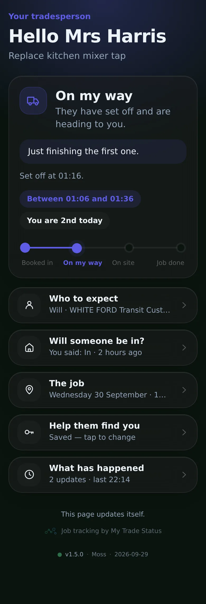
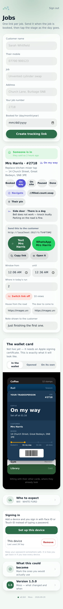
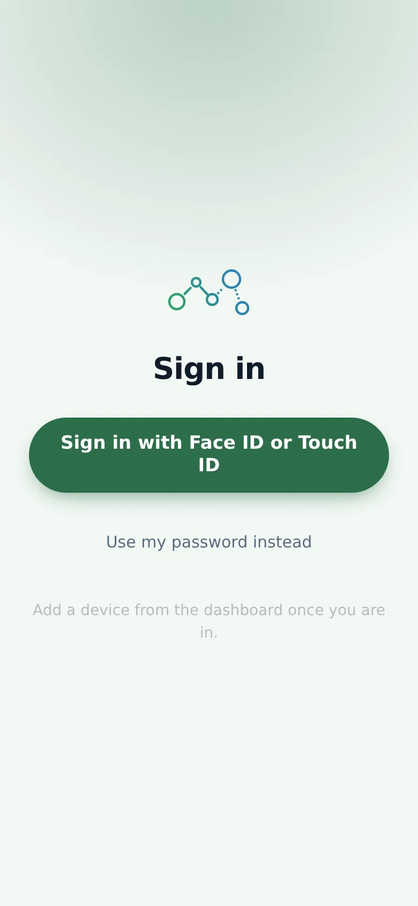
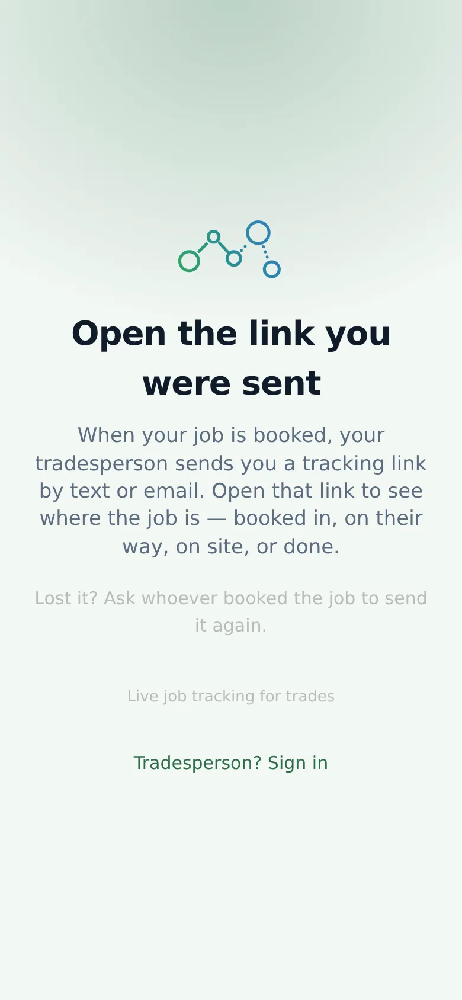

# v1.5.0 — Moss

**2026-09-29** · background `#f3f8f4` · accent `#2c6e49`

- Dashboard brought onto the same iOS material as the customer page — glass cards, capsule buttons, proper fields
- what3words and a dropped pin open the map in one tap, both sides. A Navigate button on every job
- Photos of the house and the door, set on the first visit so the next one is easy. Your logo on the page
- DVLA lookup now says exactly what it needs when the key is missing, with the link to get it

### wallet-in-stack

### wallet-opened

### wallet-alone

### customer-light

### customer-dark

### dashboard

### login

### landing

