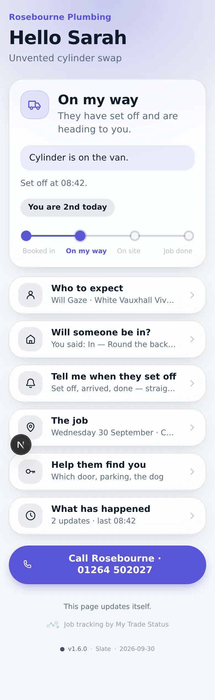
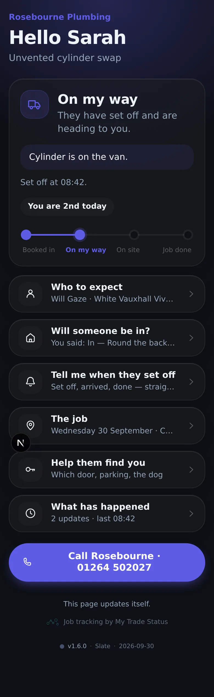
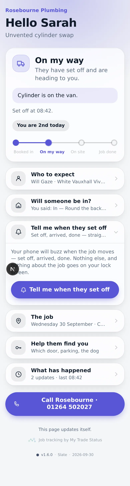
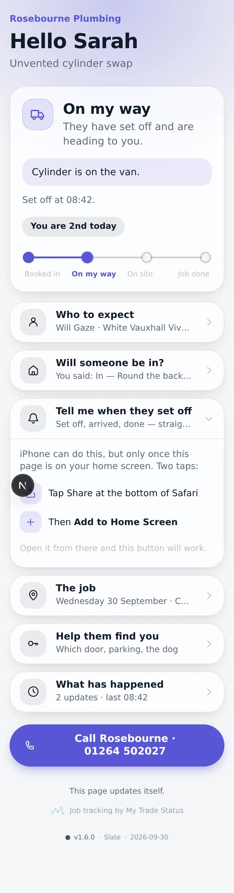
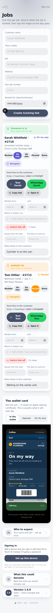
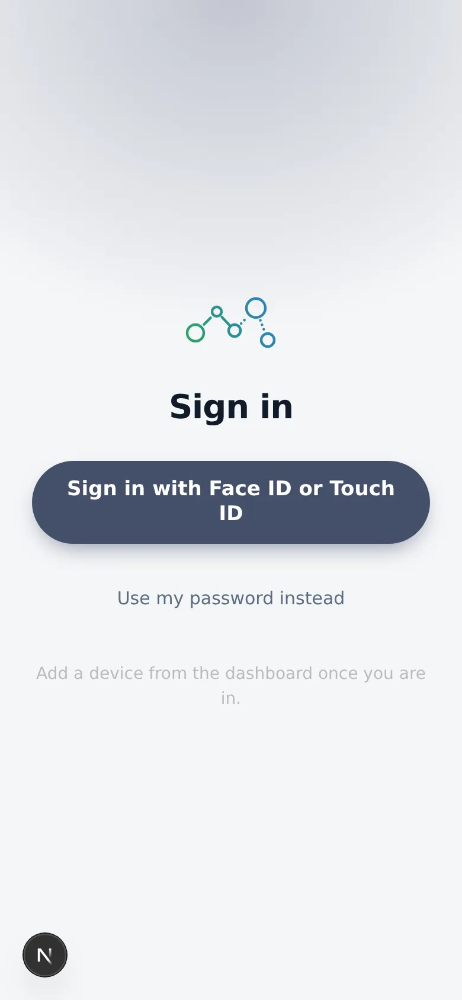
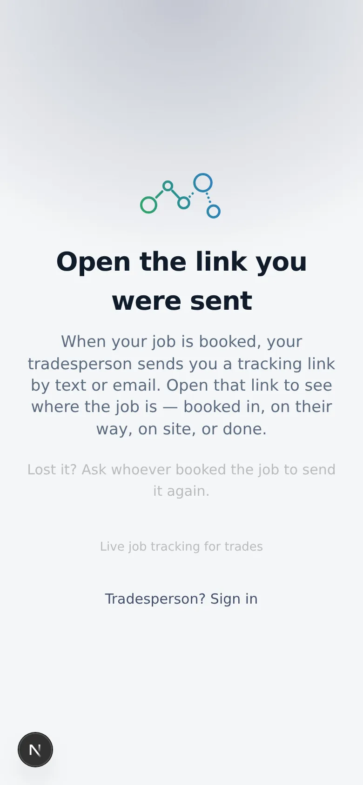

# v1.6.0 — Slate

**2026-09-30** · background `#f5f6f8` · accent `#44506b`

**Your phone buzzes when they set off.** The point of the product, finally: the
customer stops checking the page, because the page tells them. Web push, which
iOS has delivered since 16.4 to a page added to the home screen — no App Store,
no Apple Developer membership, nothing to pay.

Three rules it is built to:

- **A notification says who and what stage, and nothing else.** It lands on a
  lock screen, read by whoever picks the phone up off the kitchen table. The
  address, the job reference, the customer's name and the free-text note all
  stay behind the link.
- **It never promises a time.** "Has set off" is a fact. A push notification is
  the very worst place to promise an arrival.
- **It never blocks a stage change.** The trade tapped a button on a driveway.
  A push service having a bad afternoon must not turn that into an error.

The iPhone catch is handled rather than hidden: Safari in a tab has no
notification API at all, so the page shows the two-tap how-to instead of a
button that would do nothing.

## Not live yet

The code is done; two things outside the repo are not:

1. `npx prisma db push` — there is a new `PushSubscription` table.
2. A VAPID key pair in Vercel — `scripts/setup.sh` now generates one, and
   reuses an existing pair on a re-run so live subscriptions survive.

Until both exist the row does not render and nothing sends. The roadmap marks
it `ready`, not `live`, which is the honest state.

## About these screenshots

**Captured against sample data, not a real job** — this session had no
database, so the customer screens show a made-up job rendered through the real
components. `notify-iphone-tab` and `notify-on` are the two notification states
that matter, forced in a headless browser because it hard-denies notifications.

### customer-light

### customer-dark

### notify-on

### notify-iphone-tab

### dashboard

### login

### landing

