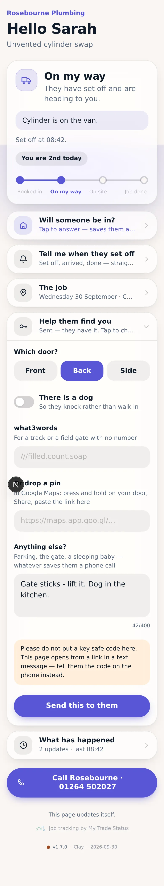
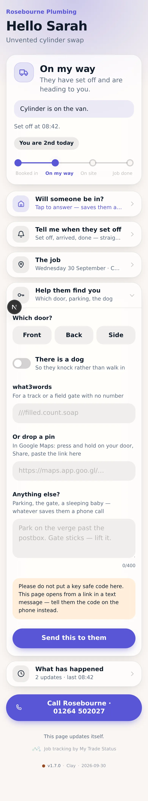
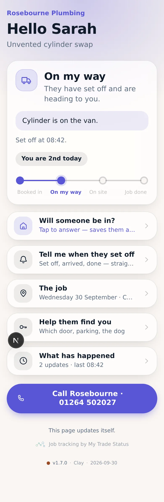
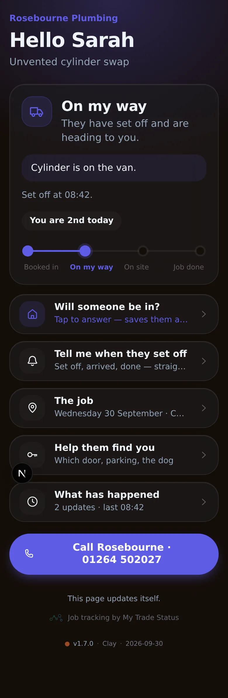
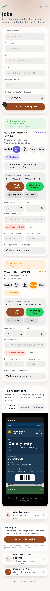
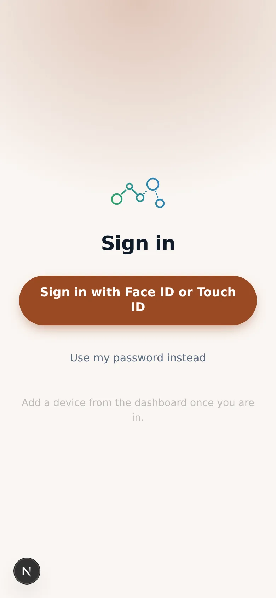
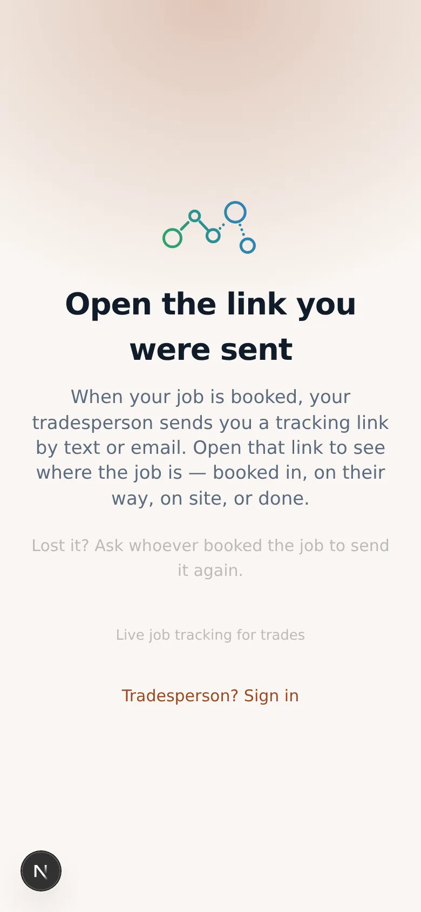

# v1.7.0 — Clay

**2026-09-30** · background `#faf6f2` · accent `#9a4a24`

**The customer's own answers came off the public page.**

A tracking link gets forwarded — to a partner, into a family group chat, onward
from there. Until this build, everyone it reached could read:

| | |
|---|---|
| Address | `Church Lane, Burbage SN8` |
| what3words | the exact square |
| Dropped pin | exact coordinates |
| **Photo of the house** | from the road |
| **Photo of the front door** | — |
| Which door | front / back / side |
| Access notes | *"gate sticks — lift it, park on the verge"* |
| Dog? | yes / no |
| Occupancy | **"No, I'm out"** |
| When | **"Between 09:00 and 11:00"** |

Separately, each was a sensible feature. Together they were a door, a time and
a way in.

No single commit caused it. The product grew from *reporting* ("on my way")
into *asking* ("will someone be in?"), and the credential never changed to
match. That is the part worth remembering: **when this product starts asking
the customer something new, stop and ask who else can read the answer.**

## What changed

`publicShape()` now carries what the **trade** told the **customer**, and never
what the **customer** told the **trade**. Fifteen fields, none of them theirs.

The customer's own phone still remembers what they typed, in its own browser
storage — so their form prefills and adding one detail does not mean retyping
five. A forwarded link on anyone else's phone gets a blank form.

`presenceAt` stays public and `presence` does not: the page may say *when*
somebody answered, never *what* they said.

The house and door photos are gone from the customer page entirely. They are
wayfinding for the trade, they are on the dashboard behind a password, and the
customer already knows what their own front door looks like.

Also fixed on the way: the notes route overwrote every access field on every
call, so the presence buttons had to re-send the door, the dog and the notes
just to preserve them — which is why those were on the page at all. It now
patches, so a field that is not sent is a field that is not changed.

## The check that has to keep passing

```bash
node scripts/check-public-shape.mjs
```

It builds a row with every field populated, runs it through `publicShape()`,
and exits non-zero naming any field that must not be there. Verified both ways:
it passes on this build, and it fails on a build with `presence` put back.

## About these screenshots

**Sample data, not a real job** — this session had no database. `dashboard`
shows that the trade still sees every word of it.

### own-device-remembers

The customer's own phone, after telling the trade. Their note is still there.



### forwarded-link-blank

The same link, opened on a different phone. Blank, and the row has gone back to
asking rather than reporting.



### customer-light



### customer-dark



### dashboard



### login



### landing


