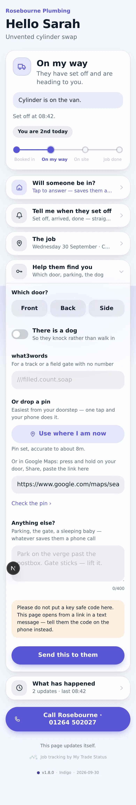
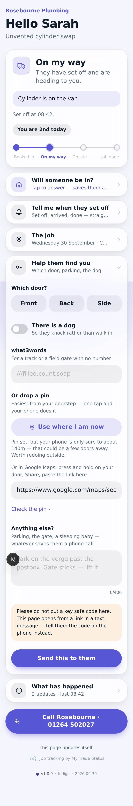
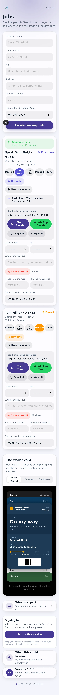
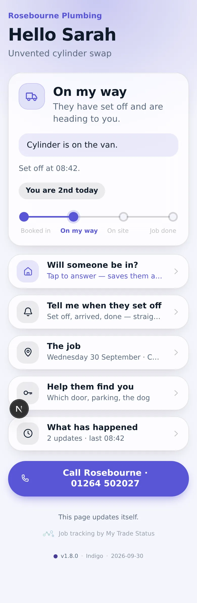
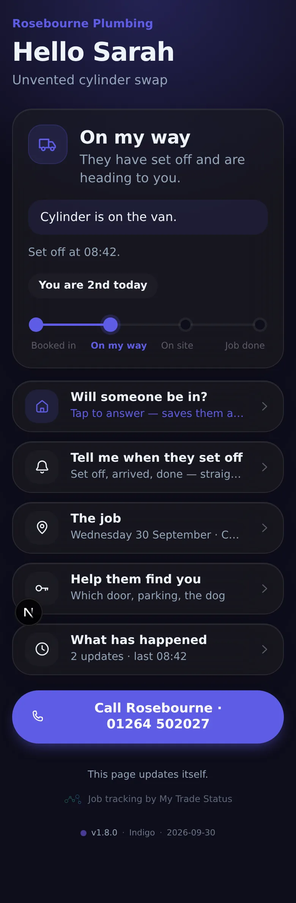
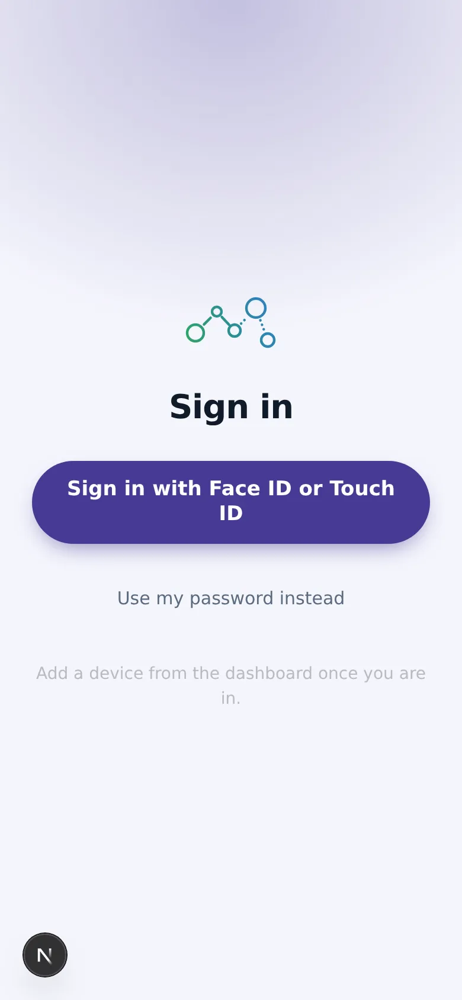
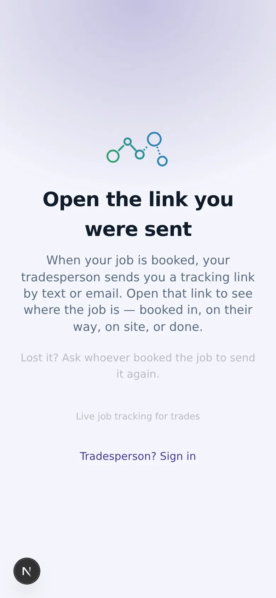

# v1.8.0 — Indigo

**2026-09-30** · background `#f5f5fc` · accent `#463a94`

**Drop a pin with one tap, from either end.**

Pasting a pin used to mean: open Google Maps, press and hold on your own door,
Share, copy, come back, paste. Six steps on a phone, standing in a hallway.

Now it is one tap. The phone gives its position, it is written into the same
`mapPin` field a pasted link goes into, and nothing needed a migration.

**The trade can drop it too**, standing at the door on the first visit — which
is the better moment, because the person standing there is the one who will
have to find it again. Next time it is a pin rather than "third gate past the
postbox".

**Navigate got better for free.** A dropped pin carries its coordinates, so
Navigate now opens turn-by-turn to the exact spot instead of a map centred near
it. A pasted share link cannot be taken apart safely, so it still opens as it
was given.

## Accuracy is the whole problem

A phone indoors in a village can be a hundred metres out. In a terrace that is
four doors down; on a farm it is the wrong field. **A pin that is confidently
wrong is worse than no pin**, because it sends a van somewhere with certainty.

So the fix is never taken on trust. It comes back with a radius, and anything
vaguer than 60m says so and asks to be redone outside.

Three paths, all tested in a browser with a simulated fix:

| Fix | What it says |
|---|---|
| 8m | *"Pin set, accurate to about 8m."* |
| 140m | *"Pin set, but your phone is only sure to about 140m — that could be a few doors away. Worth redoing outside."* |
| Refused | *"Your phone is not letting this page see where you are. Allow location for it in Settings, or paste a pin from Maps."* |

Never automatic, always a tap. Asking a phone for its location the moment a
page opens is hostile, and iOS refuses a prompt with no gesture behind it — so
"automatic" would mean a dialog nobody asked for followed by a denial that
needs a trip to Settings to undo.

## Still not doing what3words from GPS

Turning coordinates into three words needs their API and a key. Once there is a
pin it is not needed either: three words exist to be said down a phone, and a
pin is better for everything else. The field stays for anyone who already knows
theirs.

## Where the pin lives

The sharpest field in the product, so it obeys v1.7.0's rule: the trade sees it
on the dashboard, the tapping device remembers it, and it is **not** in
`publicShape()`. A forwarded link does not carry it.

## About these screenshots

**Sample data, not a real job** — this session had no database.

### pin-one-tap

### pin-vague-warning

### dashboard

Note "Drop a pin here" under Navigate.

### customer-light

### customer-dark

### login

### landing

