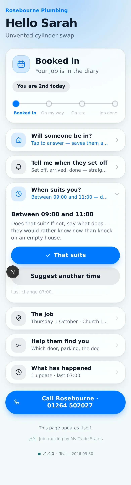
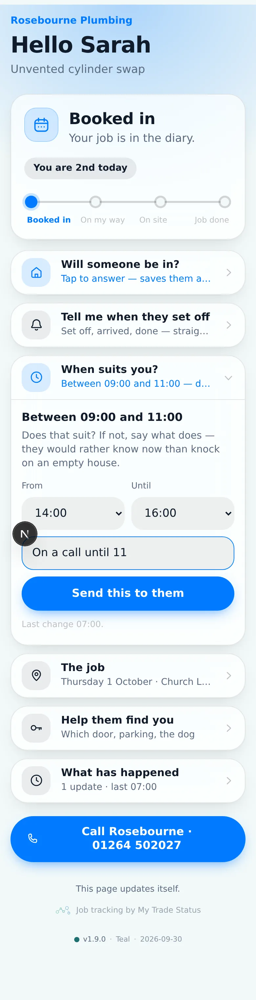
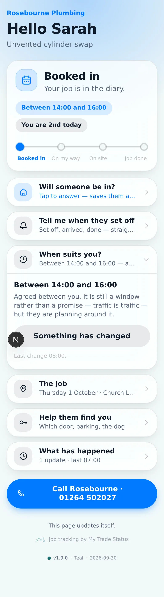
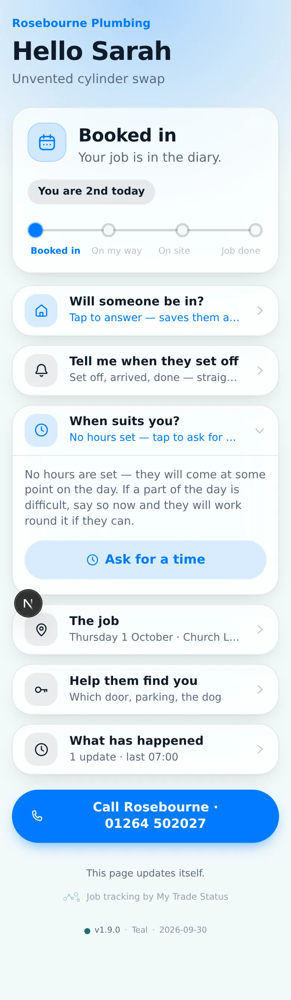
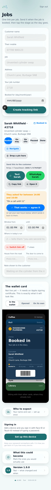
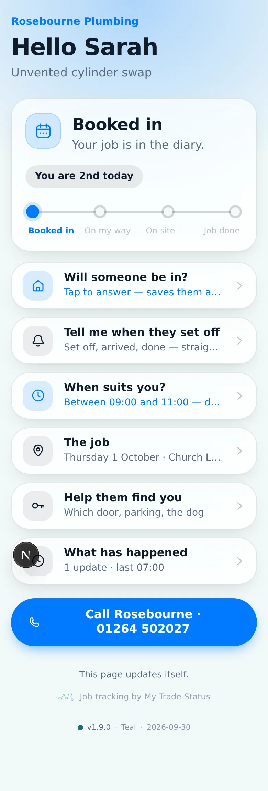
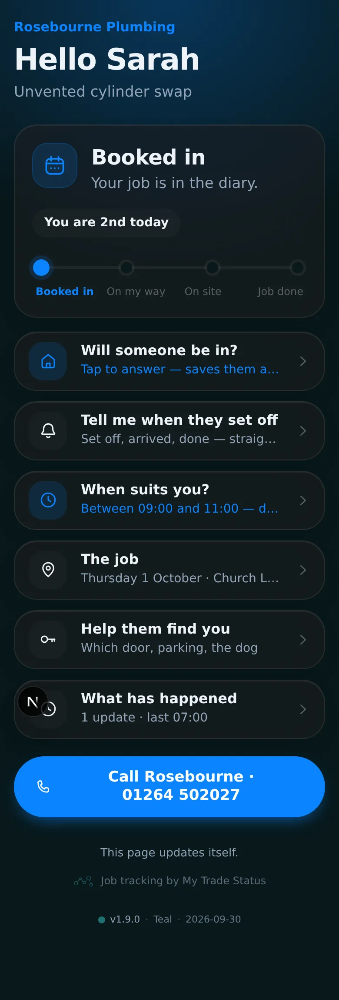
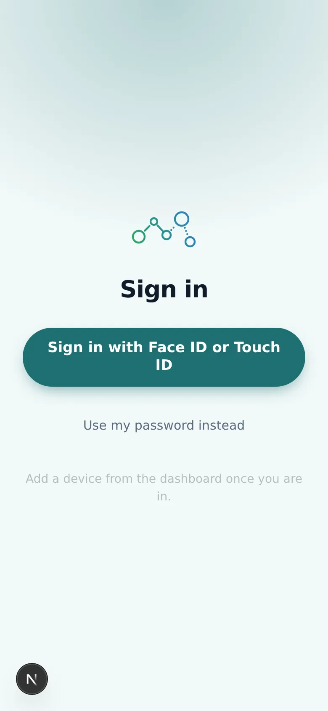
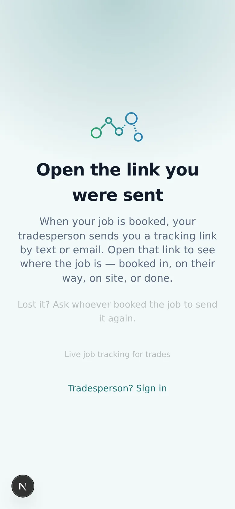

# v1.9.0 — Teal

**2026-09-30** · background `#f2f9f9` · accent `#1f6f72`

**A window is something you agree, not something you announce.**

Until this build the trade set a window and the customer read it. The first
either of them knew that 09:00 did not suit was a missed doorbell and a second
appointment — an hour lost by both, over something one exchange settles.

Now: **"Between 09:00 and 11:00 — does that suit?"** with *That suits* and
*Suggest another time*. Either end can open it; a customer with a day booked
and no hours can ask for some rather than waiting to be told.

## Not a calendar invite, and that was worth checking

Email invites have had this since the nineties: `METHOD:REQUEST`, and the
recipient's client offers Accept, Decline and Propose New Time. It is the
obvious answer and **it does not work here.**

It needs the invite to arrive as an email, in an email client, with a reply
address for the `REPLY` to go back to. This product sends a **link, by text**.
An `.ics` opened from a link just adds an event — no buttons, nobody to reply
to.

So the negotiation lives in the product, where it works over a texted link, and
the calendar file carries the result once there is one.

## One offer, and who made it

```
(nothing)  --propose-->  PROPOSED by TRADE
PROPOSED   --agree---->  AGREED
PROPOSED   --counter-->  PROPOSED by the other side
AGREED     --propose-->  PROPOSED        (plans change; it reopens)
```

A counter is simply a new proposal from the other side, so there is never a
queue of competing times to reconcile — only what is on the table and who put
it there. Four columns carry the whole thing.

## Whose window is public

v1.7.0's rule, applied: hours the **trade** put forward are theirs to publish;
hours the **customer** put forward are not, because *"I'm free between 2 and 4"*
says when a house is occupied and the link gets forwarded. Once the trade
agrees, it is something the trade is asserting and it goes public.

While a customer's counter is on the table the page says **"Waiting for them"**
and their own phone is the only thing that remembers what they asked for.

`scripts/check-public-shape.mjs` now proves both directions — that a trade's
proposal reaches its own customer, and that a customer's pending counter
reaches nobody. Verified failing when the gate is removed.

## Two things the rule made us change

**Only an AGREED window is stated as a fact.** It is the only one that reaches
the status card, `windowLabel()`, or a calendar file as a timed block. A
proposal in a calendar looks settled, and it is not. `calendar.js` used to say
in its own docstring that events were always all-day while the code below made
them timed on any window at all — both are true now.

**Times resolve in the trade's zone, never UTC.** Somebody picking 9am means
nine o'clock where they are, and Britain is an hour ahead of UTC for seven
months of the year. The first version stored 09:00Z and showed it straight back
as 10:00 — the window the customer did not ask for. Tested either side of a
clock change.

## About these screenshots

**Sample data, not a real job** — this session had no database. `dashboard`
shows the counter waiting with *"On a call until 11"* and the button to agree
it.

### window-proposed



### window-countering



### window-agreed



### window-none

Either end can start it.



### dashboard



### customer-light



### customer-dark



### login



### landing


